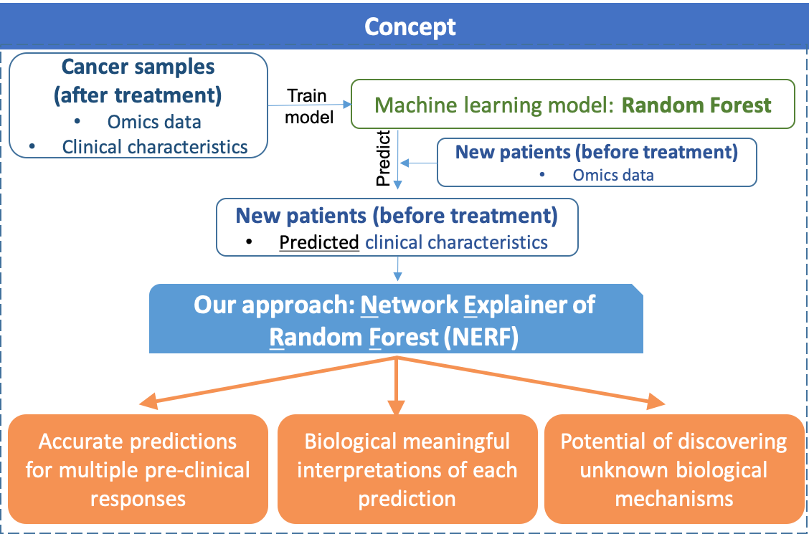
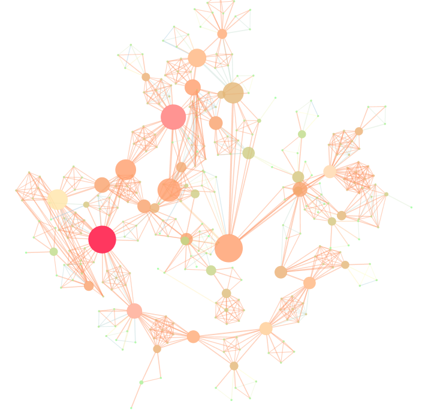
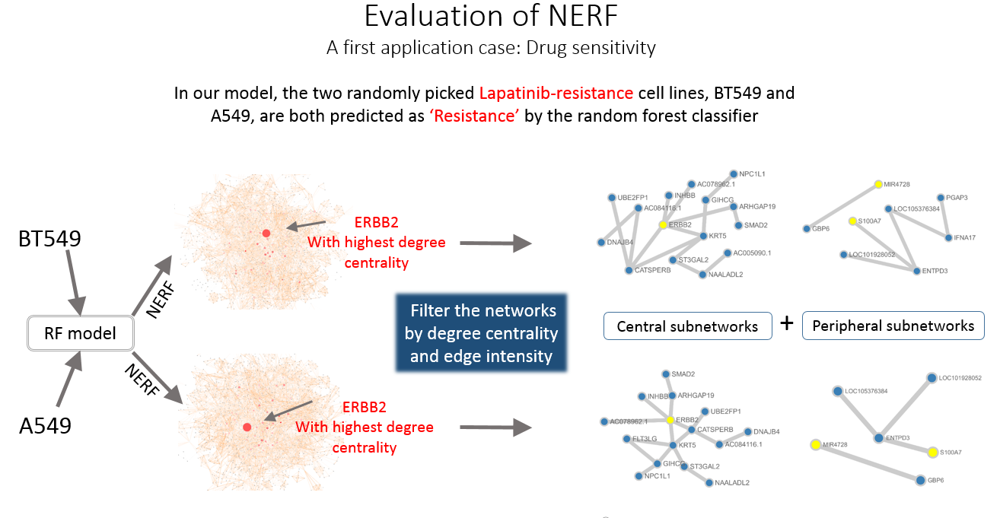
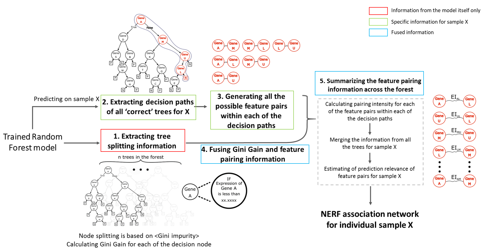

# nerf-rf-explainer

 ***legacy version***

# NERF: Network Extraction via Random Forests
**This project was originally developed during 2018-2021 as part of an academic research initiative. It is preserved here as a record of conceptual exploration in model interpretability.**
**Author:** Yue Zhang  
---

##  Overview
NERF (Network Extraction via Random Forests) is a model-agnostic interpretability framework designed to extract feature interaction networks from scikit-learn's `RandomForestClassifier` models. It transforms local decision paths into pairwise feature interactions, quantifies their edge intensities, and builds interpretable sample-specific subgraphs.

The goal is to understand **how features jointly contribute** to predictions — especially in biological datasets, where understanding *combinatorial effects* (e.g., gene-gene interactions) is critical.

---

##  Key Ideas
- Each sample traverses multiple decision paths in the forest.
- NERF extracts pairs of features that co-occur in these paths **only when the prediction is correct**.
- A local edge intensity (EI) score is calculated from the gini gains.
- A feature interaction network is constructed for each sample.

---


## Some Visual Pieces 

### 1. Sample EI Subnetwork (Cytoscape view)


### 2. Evaluation Use Case (Drug Resistance - ERBB2)


### 3. Conceptual Design Pipeline


### For more information ragrding NERF, please find the slide in docs/NERF_slides.pptx
---

##  Installation
NERF is a Python module. To install dependencies:

```bash
pip install nerf
```
If you're working locally:
```bash
pip install -e .
```

---

##  Usage

### 1. Prepare your trained `RandomForestClassifier` and a test dataset
```python
from sklearn.ensemble import RandomForestClassifier
from sklearn.datasets import make_classification
from nerf.core import run_nerf_pipeline

# Example dataset
X, y = make_classification(n_samples=200, n_features=10, random_state=42)
rf = RandomForestClassifier(n_estimators=10).fit(X, y)
```

### 2. Run NERF on one sample
```python
results = run_nerf_pipeline(
    rf=rf,
    testdf=pd.DataFrame(X),
    sample_index=0,
    feature_index=list(range(10)),
    feature_names=[f"gene_{i}" for i in range(10)]
)
```

### 3. Inspect the result
```python
# Subnetwork with strongest co-activations
print(results['subnetwork'].head())

# All EI interactions are saved to:
#   output/sample_0_everything.txt
#   output/sample_0_sub.txt
```

---

## Output Description

After running the pipeline, you get:

| File | Description |
|------|-------------|
| `output/sample_0_everything.txt` | All edges (feature_i, feature_j, EI) for one sample |
| `output/sample_0_DC.txt`         | Degree centrality of each node in the full network |
| `output/sample_0_sub.txt`        | Top-ranked subnetwork based on degree + EI cutoff |

The `results` dictionary contains:
```python
{
  'network': full_edge_df,
  'centrality': node_centrality_dict,
  'top_nodes': top_node_list,
  'top_edges': top_edge_df,
  'subnetwork': top_subnetwork_df
}
```

---

## 📁 Project Structure
```
NERF/
├── nerf/
│   └── core.py            # main implementation
├── examples/              # real data scripts **Most Inputs are not available, now serve as a legacy archived references**
├── data/                  # optional demo datasets
├── output/                # auto-generated results
├── setup.py
├── requirements.txt
└── README.md
```

---

## Use Cases
You can find working examples under `examples/`:
- `COAD_darapre.py` — colon cancer drug response
- `Example_BRCA_histological.py` — breast cancer subtype
- `falcontest.py` — synthetic tests with known rules

These show how NERF can be used for sample-specific biological hypothesis generation.


